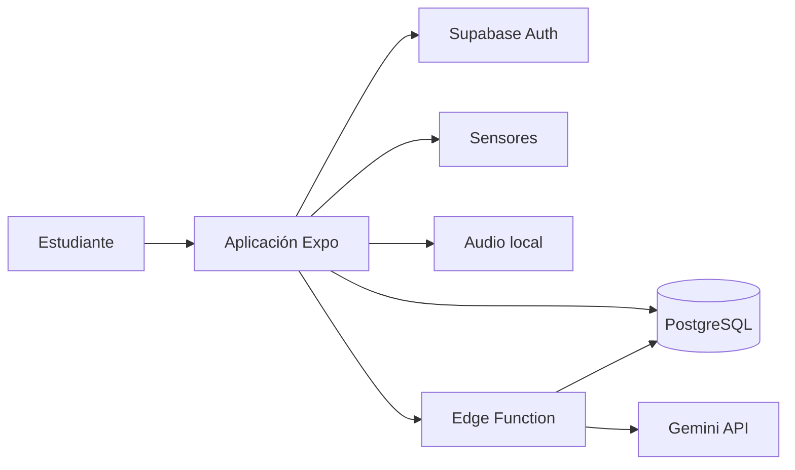

# FocusSync

FocusSync es una aplicación móvil de productividad académica construida con Expo y React Native. Combina planificación con Gemini, sesiones de enfoque controladas por los sensores del teléfono, registro de interrupciones, historial, métricas y logros.

El objetivo es ayudar al estudiante a completar sus planes con la menor cantidad posible de distracciones. La aplicación usa la posición boca abajo como condición de inicio, pausa el cronómetro cuando detecta que el teléfono fue levantado y registra cada interrupción en Supabase.

## Funcionalidades

- Registro e inicio de sesión con correo y contraseña.
- Inicio de sesión con Google mediante Supabase OAuth.
- Sesión persistente y navegación protegida.
- Generación de planes con Gemini desde IA Coach.
- Persistencia de planes, bloques y mensajes en Supabase.
- Bloques ordenados de teoría, práctica y descanso.
- Continuidad entre todos los bloques del plan.
- Cronómetro manual configurable con selectores deslizables.
- Detección de orientación y movimiento del teléfono.
- Pausa y registro de interrupciones al levantar el dispositivo.
- Descansos sin detección de interrupciones.
- Sonido local de finalización.
- Pop-up de finalización para modo manual, bloques y planes completos.
- Historial con tiempo planificado, tiempo real e interrupciones.
- Veinte consejos locales según el historial, sin consumir tokens de Gemini.
- Dashboard con meta diaria, actividad semanal y racha.
- Logros calculados con la actividad real.
- RLS para aislar los datos de cada usuario.
- Pruebas automatizadas e integración continua.

## Tecnologías

| Área | Tecnología |
|---|---|
| Aplicación | Expo SDK 54 y React Native 0.81 |
| Interfaz | React 19, StyleSheet y NativeWind |
| Navegación | Expo Router 6 |
| Lenguaje | TypeScript 5.9 |
| Backend | Supabase |
| Base de datos | PostgreSQL |
| Autenticación | Supabase Auth y Google OAuth |
| IA | Gemini mediante Supabase Edge Functions |
| Sensores | `expo-sensors` |
| Audio | `expo-audio` |
| Pruebas | Jest y React Native Testing Library |
| Contenedores | Docker Compose |
| CI | GitHub Actions |

## Arquitectura



Gemini nunca se llama directamente desde el teléfono. IA Coach invoca `generate-study-plan`; la función valida la sesión, llama al modelo, normaliza la respuesta y guarda el plan.

El historial no llama a Gemini. Sus consejos se calculan localmente con las sesiones, minutos, interrupciones, días activos y la mejora entre periodos recientes.

## Flujo principal

1. El estudiante inicia sesión o crea una cuenta.
2. En IA Coach describe la materia y el tiempo disponible.
3. La Edge Function solicita a Gemini un plan estructurado.
4. El plan y sus bloques se guardan en Supabase.
5. El estudiante inicia el primer bloque.
6. El cronómetro espera que el teléfono esté boca abajo.
7. Si se levanta, la sesión se pausa y registra una interrupción.
8. Al terminar aparece un pop-up con el resultado y el siguiente paso.
9. Los descansos continúan sin controlar la orientación.
10. Al completar el último bloque se muestra el resumen del plan.
11. El historial, dashboard y logros reflejan la actividad.

## Estructura

```text
FocusSync/
├── app/                         # Rutas de Expo Router
│   ├── (auth)/                  # Login y registro
│   ├── (tabs)/                  # Dashboard, Coach, enfoque, historial y logros
│   ├── auth/callback.tsx        # Retorno de Google OAuth
│   └── plans/                   # Lista y detalle de planes
├── assets/
│   └── sounds/completion.wav    # Sonido de finalización
├── components/                  # Componentes de UI, chat, sensores y analítica
├── features/                    # Pantallas organizadas por dominio
├── hooks/                       # Auth, cronómetro, sensores y alarma
├── lib/                         # Cliente Supabase, dashboard e historial
├── services/                    # Planes, sesiones, distracciones y notificaciones
├── supabase/
│   ├── functions/               # Edge Function de Gemini
│   ├── migrations/              # Migraciones PostgreSQL
│   └── FocusSync.sql            # Esquema completo de referencia
├── types/                       # Tipos compartidos
├── utils/                       # Analítica, consejos y formateadores
├── __tests__/                   # Pruebas automatizadas
├── Dockerfile
├── docker-compose.yml
└── package.json
```

## Requisitos

- Node.js 22 recomendado y npm.
- Expo Go en un teléfono para pruebas rápidas.
- Proyecto de Supabase.
- API key de Google Gemini.
- Docker Desktop si se usará el entorno en contenedor.

## Variables de entorno

Copia el ejemplo:

```powershell
Copy-Item .env.example .env
```

En Bash:

```bash
cp .env.example .env
```

Completa `.env`:

```env
EXPO_PUBLIC_SUPABASE_URL=https://tu-proyecto.supabase.co
EXPO_PUBLIC_SUPABASE_PUBLISHABLE_KEY=tu-publishable-key
```

La publishable key puede estar en el cliente porque RLS protege las filas. Nunca coloques una `service_role` o secret key en variables `EXPO_PUBLIC_*`.

Gemini se configura como secreto de Supabase:

```bash
npx supabase secrets set GEMINI_API_KEY=tu-api-key --project-ref tu-project-ref
```

## Ejecución sin Docker

Desde la carpeta que contiene `package.json`:

```bash
npm ci
npm run start
```

Plataformas:

```bash
npm run android
npm run ios
npm run web
```

Limpiar la caché de Metro:

```bash
npx expo start --clear
```

## Ejecución con Docker

Construir e iniciar:

```bash
docker compose up --build
```

El contenedor inicia Expo por túnel y publica los puertos `8081`, `19000`, `19001`, `19002` y `19006`. Cuando aparezca el QR, ábrelo con Expo Go.

Detener:

```bash
docker compose down
```

Reconstruir después de cambiar dependencias:

```bash
docker compose down
docker compose up --build
```

Reiniciar Expo sin recrear la imagen:

```bash
docker compose restart focussync-app
docker compose logs -f focussync-app
```

No hace falta eliminar los volúmenes para aplicar cambios normales de código.

## Configuración de Supabase

Vincula el proyecto y aplica las migraciones:

```bash
npx supabase login
npx supabase link --project-ref tu-project-ref
npx supabase db push
```

Despliega la Edge Function:

```bash
npx supabase functions deploy generate-study-plan --project-ref tu-project-ref
```

Después de modificar el modelo o la función, vuelve a desplegarla. Reiniciar Expo o reconstruir Docker no actualiza una Edge Function remota.

### Google OAuth

1. Crea las credenciales OAuth en Google Cloud.
2. Habilita Google en Supabase Auth → Providers.
3. Configura client ID y client secret.
4. Agrega las URL de redirección en Google y Supabase.
5. En móvil la aplicación usa `focussync://auth/callback`.

## Base de datos

| Tabla | Responsabilidad |
|---|---|
| `profiles` | Perfil, proveedor, meta diaria y racha |
| `study_plans` | Plan, dificultad, duración y prompt original |
| `study_blocks` | Bloques ordenados de teoría, práctica o descanso |
| `ai_messages` | Conversación de generación del plan |
| `focus_sessions` | Tiempo planificado, real y estado de la sesión |
| `distractions` | Interrupciones y datos de sensores |
| `ai_feedback` | Compatibilidad con retroalimentación persistida anterior |

```text
auth.users 1──1 profiles
profiles 1──N study_plans
study_plans 1──N study_blocks
profiles 1──N focus_sessions
focus_sessions 1──N distractions
profiles 1──N ai_messages
```

Las tablas públicas tienen RLS. Las políticas comprueban que `auth.uid()` corresponda al propietario del registro o del plan relacionado.

## IA Coach

La implementación vive en `supabase/functions/generate-study-plan/index.ts`.

La función:

- Valida el JWT mediante Supabase Auth.
- Rechaza solicitudes vacías.
- Solicita JSON estricto a Gemini.
- Reintenta errores temporales `408`, `429`, `500`, `502`, `503` y `504`.
- Aplica un timeout de 25 segundos por intento.
- Limita la respuesta a ocho bloques.
- Normaliza tipos y duraciones.
- Guarda el plan, sus bloques y los mensajes.

El modelo configurado actualmente para planes es `gemini-3.6-flash`. Para cambiarlo, actualiza la URL de la petición y el campo `ai_model`, y vuelve a desplegar la función.

## Modo Enfoque

El cronómetro se inicia desde un bloque de IA Coach, desde el detalle de un plan o con una duración manual de entre 1 minuto y 3 horas.

En bloques de enfoque:

1. El usuario pulsa **Iniciar**.
2. Se prepara el aviso de finalización.
3. El cronómetro espera una posición boca abajo estable.
4. Se crea una fila en `focus_sessions`.
5. Al levantar el teléfono, la sesión se pausa.
6. Se inserta una fila en `distractions`.
7. Para reanudar, el teléfono vuelve a colocarse boca abajo.
8. Al llegar a cero, la sesión se guarda como completada.

Los descansos avanzan sin controlar la orientación ni registrar interrupciones. Cada finalización usa un pop-up de pantalla completa. En un plan permite continuar al descanso o bloque siguiente; al final muestra el resumen acumulado.

## Sonido y notificaciones

FocusSync reproduce `assets/sounds/completion.wav` al llegar a cero.

En Expo Go, el audio depende del volumen multimedia y la aplicación debe permanecer abierta. Las funciones nativas completas de notificación en Android requieren un development build; Expo Go no incluye toda la funcionalidad de notificaciones remotas en versiones recientes.

## Historial y consejos

El historial muestra el nombre, tiempo planificado, tiempo real e interrupciones de cada sesión. Su tarjeta flotante tiene fondo sólido y una **X** para ocultarla.

El consejo se selecciona entre 20 reglas locales según:

- Sesiones completadas y minutos acumulados.
- Promedio de interrupciones.
- Sesiones sin interrupciones.
- Días con actividad.
- Comparación de las últimas cinco sesiones con las cinco anteriores.

Este análisis no llama a Gemini ni consume tokens.

## Dashboard y logros

El dashboard calcula minutos, sesiones y distracciones del día, progreso de meta diaria, racha y actividad semanal. Los logros incluyen primera sesión, primera hora enfocada, racha de tres días, sesión sin interrupciones y cinco planes creados.

## Calidad y pruebas

Ejecuta todo con:

```bash
npm run quality
```

Equivale a:

```bash
npm run lint
npm run typecheck
npm run test:coverage
```

Estado actual de referencia:

- 9 suites aprobadas.
- 39 pruebas aprobadas.
- 100% de líneas, funciones y declaraciones en los módulos incluidos en cobertura.
- 92.3% de ramas en los módulos incluidos en cobertura.

Las pruebas cubren cronómetro, recorrido del plan, regreso al modo manual, alarmas, notificaciones, resiliencia de Gemini, consejos locales, analítica y formateadores.

GitHub Actions ejecuta estas comprobaciones en pull requests y pushes a `main` mediante `.github/workflows/quality.yml`.

## Problemas frecuentes

### Puerto 8081 ocupado

```powershell
Get-NetTCPConnection -LocalPort 8081 -ErrorAction SilentlyContinue
```

Detén el proceso o contenedor anterior antes de iniciar otro Metro Bundler.

### Error de túnel `Cannot read properties of undefined (reading 'body')`

```bash
docker compose restart focussync-app
docker compose logs -f focussync-app
```

### Expo conserva código anterior

```bash
npx expo start --clear
```

Con Docker, reinicia `focussync-app`.

### IA Coach devuelve 503

La función reintenta automáticamente. Si continúa, revisa la cuota de Gemini, el secreto `GEMINI_API_KEY`, los logs de la Edge Function y la disponibilidad del modelo.

### Google no vuelve a la app

Verifica que `focussync://auth/callback` esté permitido y que Google use la URL de callback indicada por Supabase.

### No se detecta la orientación

Prueba en un teléfono físico, concede permisos de movimiento, usa una superficie estable y reinicia Expo Go si los sensores permanecen sin disponibilidad.

## Seguridad

- El frontend solo contiene la URL y publishable key de Supabase.
- `GEMINI_API_KEY` permanece en secretos de Supabase.
- La `service_role` solo se usa dentro de la Edge Function.
- La función valida al usuario con `auth.getUser()`.
- RLS protege las filas de cada usuario.
- Los servicios filtran los datos por el usuario autenticado.

## Documentación adicional

- `ARQUITECTURA_PROYECTO.md`: arquitectura detallada e histórica.
- `supabase/README.md`: configuración resumida del backend.
- `supabase/FocusSync.sql`: esquema completo de referencia.
- `supabase/migrations/`: historial reproducible del esquema.

## Antes de subir cambios

```bash
npm run quality
git status
```

No subas `.env`, claves de Gemini, claves secretas de Supabase ni credenciales. Conserva `package-lock.json` al cambiar dependencias para que Docker, CI y los equipos locales instalen las mismas versiones.
