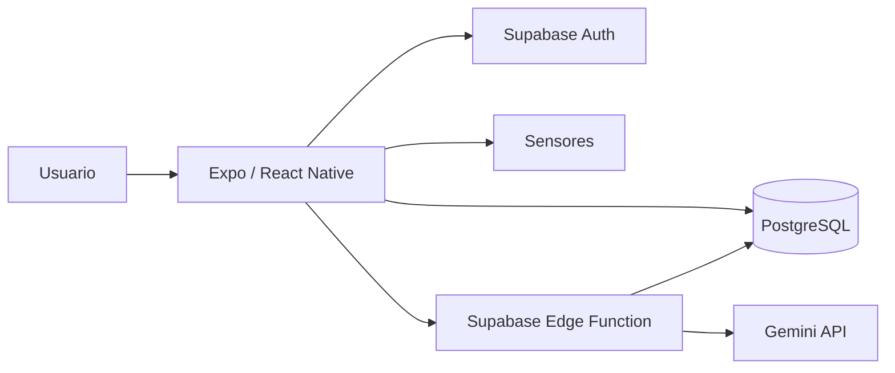

# FocusSync

FocusSync es una aplicación móvil que ayuda a los estudiantes a organizar su tiempo, seguir planes generados por inteligencia artificial y reducir las distracciones durante cada sesión.

La aplicación está construida con Expo, React Native, TypeScript y Supabase. IA Coach usa Gemini para convertir una solicitud escrita en un plan formado por bloques de teoría, práctica y descanso. Durante los bloques de enfoque, los sensores del teléfono detectan si el dispositivo fue levantado, pausan el cronómetro y registran la interrupción.

> La guía completa de instalación, arquitectura, base de datos, IA, sensores, Docker, pruebas y solución de problemas está en [FocusSync/README.md](FocusSync/README.md).

## Funciones principales

- Registro e inicio de sesión con correo, contraseña y Google.
- Generación de planes de estudio mediante Gemini.
- Guardado de planes y bloques en Supabase.
- Cronómetro manual de 1 minuto a 3 horas.
- Ejecución continua de bloques y descansos.
- Detección de interrupciones usando los sensores del teléfono.
- Sonido y pop-up de pantalla completa al finalizar.
- Historial con tiempo real, tiempo planificado e interrupciones.
- Veinte consejos locales que no consumen tokens de Gemini.
- Dashboard, actividad semanal, meta diaria, rachas y logros.
- Seguridad de datos mediante Row Level Security.

## Arquitectura resumida



## Inicio rápido

La aplicación está dentro de la carpeta `FocusSync`:

```bash
cd FocusSync
npm ci
```

Crea `.env` desde `.env.example` y configura:

```env
EXPO_PUBLIC_SUPABASE_URL=https://tu-proyecto.supabase.co
EXPO_PUBLIC_SUPABASE_PUBLISHABLE_KEY=tu-publishable-key
```

Inicia Expo:

```bash
npm run start
```

También puede ejecutarse con Docker:

```bash
docker compose up --build
```

## Supabase y Gemini

La base de datos se reproduce desde `FocusSync/supabase/migrations/`. La Edge Function está en `FocusSync/supabase/functions/generate-study-plan/`.

Configura Gemini como secreto y despliega la función:

```bash
npx supabase secrets set GEMINI_API_KEY=tu-api-key --project-ref tu-project-ref
npx supabase functions deploy generate-study-plan --project-ref tu-project-ref
```

La clave de Gemini y la `service_role` nunca deben agregarse a `.env` ni exponerse como variables `EXPO_PUBLIC_*`.

## Calidad

```bash
cd FocusSync
npm run quality
```

Estado de referencia:

- 9 suites de pruebas aprobadas.
- 39 pruebas aprobadas.
- Lint sin errores.
- TypeScript sin errores.
- 100% de líneas, funciones y declaraciones en los módulos incluidos en cobertura.
- 92.3% de cobertura de ramas en esos módulos.

GitHub Actions ejecuta estas comprobaciones en cada pull request y push a `main`.

## Documentación

- [Manual técnico completo](FocusSync/README.md)
- [Arquitectura del proyecto](FocusSync/ARQUITECTURA_PROYECTO.md)
- [Backend Supabase](FocusSync/supabase/README.md)
- [Esquema SQL](FocusSync/supabase/FocusSync.sql)
